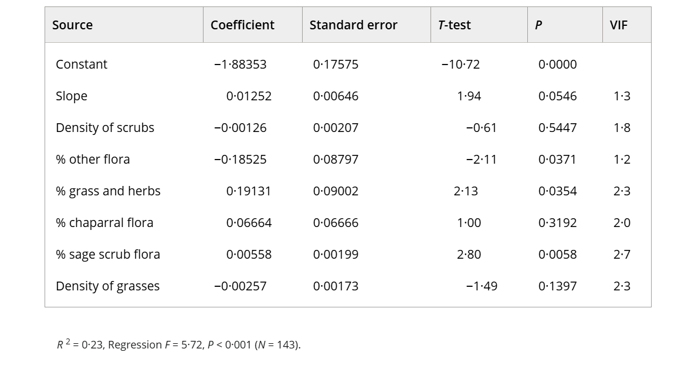

# Set Up

Packages

```{r}
#| label: packages

# reading in packages
library(tidyverse)
library(here)
library(janitor)
library(readxl)

```

Data: 

```{r}
#| label: data

# creating object from 'kelp' from data ** come back to change this for hw and midterm lowkey
kelp <- read.csv(here('data', 'temp-kelp.csv'))
mz_data <- read_xlsx(here('data', '193DS-personal-data.xlsx'))

```

Cleaning

```{r}
#| label: cleaning-data

# create new object called 'mz_clean' from 'mz_data'
mz_clean <- mz_data |> 
  # clean names
  clean_names() |>
  # create new data column 'completed_v_intended'
  mutate(
    # use data from select columns to calculate new column
    completed_v_intended = (number_of_completed_tasks/number_of_intended_tasks) * 100
  )

```

Aesthetics

```{r}
#| label: aesthetics

theme_set(theme_classic())

```

# Problem 1

## a.

The appropriate tests to determine the strength of the relationship between temperature and giant kelp frond elongation rate are the Pearson's correlation test and the Spearman rank correlation test. While both tests can be used to determine relationship strength, Pearson's correlation is parametric, assuming continuous and normally distributed variables with independent observations, and explores the linear relationship between variables. On the other hand, the Spearman rank correlation is non-parametric, assuming independent observations, and explores the monotonic relationship between variables.

## b.

```{r}
#| label: test-1-visualization

# base layer: ggplot
ggplot(
  # starting data frame
  data = kelp,
  # x-axis
  mapping = aes(x = temp_c,
                # y-axis
                y = kelp_elong)
) +
  # first layer: points
  geom_point(
    # coloring points
    color = 'chartreuse4',
    # changing opacity
    alpha = 0.8
  ) +
  # relabelling x-axis, y-axis, and title
  labs(
    # label x-axis
    x = 'Ocean Temperature (°C)',
    # label y-axis
    y = expression(paste('Giant Kelp Frond Elongation Rate (cm day' ^-1,')')),
    # add chart title
    title = 'Correlation between Ocean Temperature and Giant Kelp Frond Growth')

```

## c.

### assumption checking 

```{r}
#| label: assumption-checking-1

# base layer: ggplot
ggplot(
  # starting data frame
  data = kelp,
  # x-axis
  mapping = aes(x = temp_c,
                # y-axis
                y = kelp_elong)
) +
  # first layer: points
  geom_point(
    # coloring points
    color = 'chartreuse4',
    # changing opacity
    alpha = 0.8
  ) +
  # relabelling x-axis, y-axis, and title
  labs(
    # label x-axis
    x = 'Ocean Temperature (°C)',
    # label y-axis
    y = expression(paste('Giant Kelp Frond Elongation Rate (cm day' ^-1,')')),
    # add chart title
    title = 'Correlation between Ocean Temperature and Giant Kelp Frond Growth')

```

Because I plan on running a Spearmans rank correlation test, I only had to check if my data was independent and monotonic. I checked independence by ensuring that proper methodology was being used when collecting data (data collected individually, stated in Problem 1 introduction), and for a monotonic relationship by creating a visualization. After checking my assumptions, I concluded that I have independent observations, and that my data is monotonic -- as ocean temperature increases, giant kelp frond elongation rate decreases.

### test running

```{r}
#| label: test-running-1

# correlation test
cor.test(
  # y-variable
  kelp$kelp_elong,
  # x-variable
  kelp$temp_c,
  # use spearmans test
  method = 'spearman',
  # use normal p-approximation
  exact = FALSE)

```

## d.

To evaluate the strength of the relationship between temperature and giant kelp frond elongation rate I used a Spearmans rank correlation test. I chose to use Spearmans test over Pearsons as I did not check for normality nor a linear relationship. After running the Spearmans test, I found a strong negative relationship between ocean temperature and giant kelp frond elongation rate (Spearman $\rho$ = -0.69, S = 9216.1, p = 1.29 * 10^-5^, $\alpha$ = 0.05).

## e.

[]

## f.

```{r}
#| label: assumption-checking-2

# base layer: ggplot
ggplot(
  # starting data frame
  data = kelp,
  # y-axis: kelp frond elongation rate
  mapping = aes(sample = kelp_elong)
) +
  # first layer: QQ reference line
  geom_qq_line(
    # coloring line
    color = 'navyblue'
  ) +
  # second layer: QQ points
  geom_qq(
    # coloring points
    color = 'chartreuse4', 
    # changing opacity
    alpha = 0.6
  ) 

```

```{r}
#| label: test-running-2

# correlation test
cor.test(
  # y-variable
  kelp$kelp_elong,
  # x-variable
  kelp$temp_c,
  # use pearsons test
  method = 'pearson')

```

Yes, both tests would have led me to the same decision -- finding a strong negative relationship and rejecting the null -- as both tests resulted in a strong negative correlation of -0.69 (correlation coefficients: |0.7| - |0.9| = strong correlation). After running the Pearson's test, I found a strong negative relationship between ocean temperature and giant kelp frond elongation rate (Pearson's r = -0.69, t(30) = -5.19, p = 1.37 * 10^-5^, $\alpha$ = 0.05). This conclusion is the same as my conclusion after running the Spearman's test. 

# Problem 2

## a.

```{r}
#| label: plot-1-working-with-others

# base layer: ggplot
ggplot(
  # use data frame 'mz_clean'
  data = mz_clean,
  # x from 'working_with_others_y_n' col
  mapping = aes(x = working_with_others_y_n,
                # y from 'completed_v_intended' col
                y = completed_v_intended,
                # coloring by 'working_with_others_y_n'
                color = working_with_others_y_n,
                # fill by 'working_with_others_y_n'
                fill = working_with_others_y_n)
) +
  # first layer: boxplot
  geom_boxplot(
    # reduce opacity
    alpha = 0.75
  ) +
  # second layer: jitterplot
  geom_jitter(
    # remove vertical jitter
    height = 0,
    # add horizontal jitter
    width = 0.2
  ) +
  # changing colors
  scale_color_manual(
    # 'forestgreen' for 'y'
    values = c('y' = 'forestgreen',
               # 'mediumvioletred' for 'n'
               'n' = 'mediumvioletred')
  ) +
  # changing fill colors
  scale_fill_manual(
    # 'lawngreen' for 'y'
    values = c('y' ='lawngreen',
               # 'violetred' for n
               'n' = 'violetred1')
  ) +
  # changing titles and axes names
  labs(
    # label x axis
    x = 'Working with others (no/yes)',
    # label y axis
    y = '% of completed tasks',
    # change title
    title = 'Task completion seperated by work type',
    # change subtitle
    subtitle = '5/27/26') + 
  # remove legend
  theme(
    legend.position = 'none'
  )

```

```{r}
#| label: plot-2-mood

# base layer: ggplot
ggplot(
  # use data frame 'mz_clean'
  data = mz_clean,
  # x from 'mood_exhaustion_1_5' col
  mapping = aes(x = mood_exhaustion_1_5,
                # y from 'completed_v_intended' col
                y = completed_v_intended,
                # group by 'mood_exhaustion_1_5'
                group = mood_exhaustion_1_5,
                # fill by 'mood_exhaustion_1_5'
                fill = mood_exhaustion_1_5,
                color = mood_exhaustion_1_5)
) +
  # first layer: boxplot
  geom_boxplot(
    # reduce opacity
    alpha = 0.75
  ) +
  # second layer: jitterplot
  geom_jitter(
    # remove vertical jitter
    height = 0,
    # add horizontal jitter
    width = 0.2
  ) +
  # changing colors
  scale_color_manual(
    # 'darkred' for 'one'
    values = c('a1' ='darkred',
               # 'sienna4' for 'two'
               'b2' = 'sienna4',
               # 'darkgoldenrod4' for 'three'
               'c3' = 'darkgoldenrod4',
               # 'darkgreen' for 'four'
               'd4' = 'darkgreen',
               # 'navy' for 'five'
               'e5' = 'navy')
    ) +
  # changing fill colors
  scale_fill_manual(
    # 'red' for 'one'
    values = c('a1' ='red',
               # 'orange' for 'two'
               'b2' = 'orange',
               # 'yellow' for 'three'
               'c3' = 'yellow',
               # 'green' for 'four'
               'd4' = 'green')
  ) +
  # changing x-axis displays
  scale_x_discrete(
    # a1 to 1
    labels = c('a1' = '1',
               # b2 to 2
               'b2' = '2',
               # c3 to 3
               'c3' = '3',
               # d4 to 4
               'd4' = '4',
               # e5 to 5
               'e5' = '5')
  ) +
  # changing titles and axes names
  labs(
    # label x axis
    x = 'Mood (1-4)',
    # label y axis
    y = '% of completed tasks',
    # change title
    title = 'Task completion seperated by mood',
    # change subtitle
    subtitle = '5/27/26') + 
  # remove legend
  theme(
    legend.position = 'none'
  )

```

## b.

[]

# Problem 3

## a.

An affective visualization for my personal data could take the form of a drawing, showing box plots -- representing mood -- that are being climbed/conquered by a person. For example, if a good mood leads to more work being completed, an affective visualization could show a raised large stack of papers (higher box plot) with sticky tabs sticking out (overlaid data) and a confident/smiling person lifting them above their head. Another affective visualization could be another drawing, showing a linear model -- representing work completed -- that is being "weighed down" by the amount of things that I have in my bag (representing the time I spend on campus). Both of these "statistical visualizations" (boxplot, linear model) would be represented via something like stacks of paper, rather than points/lines indicating work being completed. Ideally these visualizations would make the viewer understand what factors/feelings/emotions are influencing work completion, and better relate/understand the graph.

## b. 

[insert image]

## c.

[insert image]

## d. 

[]

## e.

[ENVS 193DS Affective Visualization Presentation](https://docs.google.com/presentation/d/1uCG-GdxWvUQCitZFn2xcTzJ8NKknzWKenxtSjhKxEmk/edit?usp=sharing)

# Problem 4

## a. 

In this paper, the researchers use multiple statistical tests to analyze the effect of landscape differences (size, disturbance, etc.) on shrew population abundance. The statistical tests that the authors are using to address their main research question are linear regression, logsitic regression, ANOVA, Shapiro-Wilk, and the Kruskal-Wallis tests. Attached below is a table created using data from a linear regression test, showing how different landscapes can impact a specifc shrews species (Notiosorex crawfordi) population distribution and abundance.



## b.

The table clearly represents the data underlying the tests. It displays each predictor (ex. control, density of scrubs, etc.) and the variables for each predictor used to calculate expected shrew abundance in locales displaying variations of these predictors. This clearly shows the data that the scientists used to run the tests. However, it is lacking in data showing how these variables were found, which is likely in another table.

## c.

The authors moderately handle visual clutter. While it is clear what is being displayed in the table as there is little non-data information provided, the table itself has inconsistent formatting, with misaligned numbers/columns. However, the "data:ink ratio" is very low/good -- the majority of "ink" is being used to represent actual data -- there is very little visual clutter relative to the information being presented. Subsequently, while the aesthetics/organization could be better, the visual clutter is low, and the data is clearly communicable.

## d.

To make this table better, I would relabel the 'Source' column to 'Predictors', reformat/align the data within the columns, and add column lines to help organize my data/make my table look neater. The first change is because the variables listed under 'Source' are all variables that are being used to predict shrew abundance; subsequently, changing the column title will make it clearer to the reader what they are looking at -- they will not have to figure out what 'Source' indicates, and will have a better understanding that these variables are being used as predictors in the linear regression data. The remaining two changes are to improve table organization: currently the data is misaligned with inconsistent margins -- by aligning margins, and putting clear column lines in which to align margins to, the chart will look better and be easier to read.

